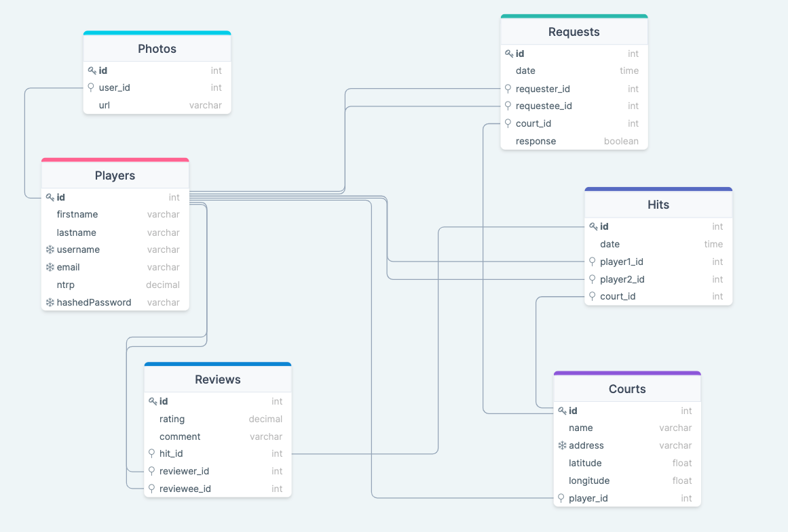

# 40Love

40Love is a full-stack web application that helps tennis players find hits at public tennis courts. Players can select public courts on the map where they are able to play; they can see who else is available at those courts. Players can send others a request to hit, and if accepted, a hit will be scheduled. Players can rate and review each other after a hit to establish reputation.

[Live link](https://forty-love.herokuapp.com)

## Technologies

#### Front End

#### Back End

#### Deployment and Package Management

## Features

#### Minimum Viable Product

-   Authentication
-   Public Tennis Courts via Map
-   Player List @ Courts by NTRP Rating
-   Player Profile Page
-   Hit Request / Acceptance
-   Reviews

#### Future Features

-   Messaging

## Database Schema

## API Routes

### Backend Routes

#### Auth API

| Endpoint               | HTTP Verb |                                Description |
| :--------------------- | :-------: | -----------------------------------------: |
| /api/auth              |    GET    |                          Authenticate User |
| /api/auth/login        |   POST    |                             Logs a user In |
| /api/auth/logout       |    GET    |                            Logs a user out |
| /api/auth/signup       |   POST    |        Creates a new user and logs them in |
| /api/auth/unauthorized |    GET    | Returns unauthorized JSON when failed auth |

#### Players API

| Endpoint                    | HTTP Verb |                           Description |
| :-------------------------- | :-------: | ------------------------------------: |
| /api/players/:id            | GET       |                    Gets single player |
| /api/players/:id/hits       | GET       |       Gets all hits for single player |

#### Courts API

| Endpoint                    | HTTP Verb |                           Description |
| :-------------------------- | :-------: | ------------------------------------: |
| /api/courts                 | GET       |                       Gets all courts |
| /api/courts/:id             | GET       |                     Gets single court |
| /api/courts/:id/players     | GET       | Check if current user has added court |
| /api/courts/:id/players     | POST      |          Add player to specific court |
| /api/courts/:id/hits        | GET       |            Get hits at specific court |
| /api/courts/:id/hits        | POST      |          Create hit at specific court |

#### Hits API

| Endpoint              | HTTP Verb |        Description |
| :-------------------- | :-------: | -----------------: |
| /api/hits/:id         | GET       |            Get hit |
| /api/hits/:id         | POST      |         Create hit |
| /api/hits/:id         | DELETE    |         Delete hit |

#### Reviews API

| Endpoint              | HTTP Verb |        Description |
| :-------------------- | :-------: | -----------------: |
| /api/reviews/:id      | GET       |         Get review |
| /api/reviews/:id      | POST      |      Create review |
| /api/reviews/:id      | PATCH     |        Edit review |
| /api/reviews/:id      | DELETE    |      Delete review |

